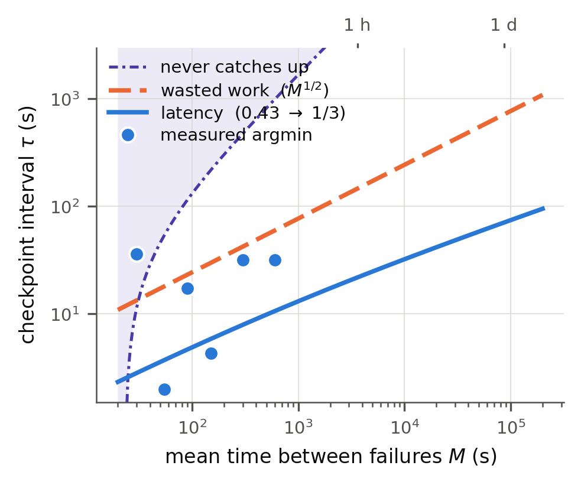

<!-- 영문 제출본 — 제출본.md(한글)의 번역. 2026-09-12.
     번역 원칙: 수치·구조·주장 강도를 원문과 동일하게 유지. 새 주장 추가 없음.
     용어 고정: pre-specified(사전 확정) / structural validation(구조 검증) /
     capacity(wasted-work) baseline(용량·낭비 기준) / effective outage(실효 공백) /
     latency-equivalent checkpoint cost(지연 등가 체크포인트 비용) /
     empirical analysis threshold(경험적 분석 임계값).
     ※ 최종 문장은 저자가 직접 검토·수정하십시오. 제출 전 이 주석 삭제. -->

# Checkpoint Interval Optimization for Latency-Sensitive Distributed Stream Processing

**[AUTHOR BLOCK — to be completed by the authors]**

[First Author]\*, [Co-author]\*\*, [Advisor]\*\*
\* Dept. of ..., \*\* Dept. of Computer Science & Engineering, Graduate School,
Dankook University, Yong-in, Republic of Korea
[emails], ymnah@dankook.ac.kr

---

## Abstract

*Abstract*— Stateful distributed stream processing systems such as Apache Flink take
periodic checkpoints in order to recover from failures. A short interval raises the
overhead imposed on normal processing, while a long interval increases the amount of
reprocessing after a failure and therefore the latency. Existing work on stream
checkpoint intervals has largely selected the interval on the basis of system
utilization or processing efficiency. Latency-sensitive applications, however, call for
an objective that directly minimizes the delay individual records actually experience.
This paper focuses on the replay backlog that arises after a failure when the source is
a durable log such as Kafka. Because live input keeps arriving during recovery, the
backlog drains not at the full processing capacity but only at the residual capacity
(μ_d − λ); from this we derive that the failure cost grows with the **square** of the
age of the last checkpoint. Combining this with the steady-state checkpoint cost yields
a latency-optimal interval that grows more slowly than the √M family obtained from a
capacity-loss (wasted-work) baseline — the local exponent falls from about 0.43 to 0.35
— so the two criteria diverge further as failures become rarer. To validate the proposed
backlog-drain geometry itself, we measured, for each injected failure, the input rate,
the processing rate during recovery, and the peak latency **on that same failure**, and
compared the resulting **parameter-free** geometric estimate against the measured excess
latency area, using data collected from experimental campaigns comprising 255 single-node runs and about 22 two-node runs on Apache Flink 1.20.5 with Kafka 3.9.2. Because the peak latency is taken from the same episode, this
is a **structural validation** of the drain geometry rather than out-of-sample
prediction. In the reference condition a linear regression of the measured area on the
geometric estimate gives R² = 0.996 with a slope of 1.107, showing a strong linear association and close agreement in scale. The latency-equivalent checkpoint cost was
0.43–0.61 times the checkpoint duration with single-node local storage, and 0.18–0.23
in the two-node remote-storage configuration; the two configurations exhibited different
cost characteristics.

*Keywords*— Apache Flink, Apache Kafka, Checkpoint, Fault Recovery, Stream Processing,
Latency Optimization

---

## I. Introduction

Real-time log analytics, financial transaction processing and IoT monitoring all require
continuously arriving data to be processed at low latency. Stateful distributed stream
processing systems such as Apache Flink store operator state and input progress in
checkpoints so that a consistent state can be restored after a failure, which is
essential for exactly-once guarantees. Checkpoints, however, consume storage and CPU
resources, so the interval at which they are taken has to be chosen.

A short checkpoint interval τ shortens the span that must be replayed after a failure
but degrades normal processing; a long τ reduces the steady-state overhead but leaves
more data to recover. Interval selection is therefore a trade-off between a steady-state
cost and a recovery cost. The classical analyses of Young [1] and Daly [2] treat this
balance, and later work has addressed distributed stream settings [3], [4], [5].

This paper claims neither that it is the first to study stream checkpoint intervals nor
that prior work ignored latency. Our focus is on **the objective function by which the
interval is chosen**. Unlike the utilization and processing-efficiency objectives that
prior work has mainly considered, what matters in a latency-sensitive application is how
long each record caught by a failure is delayed. In particular, when the input is a
durable log such as Kafka, data is not lost on failure: the source is rewound to the
position recorded in the last checkpoint and the records are processed again. Since new
live input continues to arrive at the same time, the replay backlog drains only at the
residual capacity rather than at the full processing capacity.

This paper makes three contributions.

1. We model the backlog-drain process under durable replay as a record-weighted latency
   area and derive that the failure cost is proportional to the **square** of the age of
   the last checkpoint.
2. We combine the steady-state checkpoint cost and the replay cost into a single latency
   objective, derive the optimal interval, and show that it scales differently from the
   √M scaling of a capacity-loss baseline.
3. We measure each term independently in Flink/Kafka experiments and evaluate by
   regression whether a **geometric expression containing no data-fitted parameters**
   accounts for the measured latency area (R² = 0.996, slope 1.107).

## II. Related Work

### A. Classical Checkpoint-Interval Models

Young [1] approximated the optimal interval by balancing the cost of recomputation
against the cost of checkpointing, and Daly [2] extended this to a higher order. These
models also roll back to the last checkpoint and re-execute after a failure.
Distinguishing the classical setting from the streaming one as "batch only saves state
while only streams rewind" is therefore inaccurate. The more fundamental difference is
that a stream is an unbounded computation that does not terminate, and that **new data
keeps arriving while recovery is in progress**.

### B. Checkpoint Optimization for Stream Processing

Zhuang et al. [3] observed that traditional OCI models treat recovery time as merely the
execution time elapsed since the last checkpoint, which does not fit stream processing,
and that recovery depends on the live input and the reprocessing workload. Jayasekara et
al. [4] modeled the interval that maximizes the utilization of a distributed stream and
validated it on Flink, and evaluated latency and throughput effects in later work [6].
Zhang et al. [5] estimated tuple latency and recovery time as a function of workload
intensity on Flink and analyzed the resulting optimal interval. Consistent snapshots in
distributed systems originate in the marker-based algorithm of Chandy and Lamport [8];
in stream processing, Sebepou and Magoutis [9] proposed incremental operator-state
checkpointing overlapped with processing. Carbone et al. [7] proposed the asynchronous
barrier snapshotting that underlies Flink checkpoints, and later described Flink's state
management and recovery architecture in detail [10].

This work builds on these but differs in that it explicitly derives the geometry by
which a replay backlog drains in the presence of continuous arrivals, and constructs
record-weighted latency directly as the objective from that geometry. That is, whereas
prior work optimizes utilization or processing efficiency, or models workload-dependent
tuple latency, we derive the record-weighted latency cost directly from the
backlog-drain geometry. Table I summarizes the difference in objective.

**TABLE I. COMPARISON OF OBJECTIVES IN RELATED WORK AND THIS WORK**

| Work | Objective | Validation | Difference from this work |
|---|---|---|---|
| Young [1] / Daly [2] | Wasted work / checkpoint cost | Analytical | Bounded computation; no input arriving during recovery |
| Zhuang et al. [3] | Processing efficiency (online OCI adjustment) | Simulation + real datasets | Identifies and models the input dependence of the recovery workload |
| Jayasekara et al. [4], [6] | Utilization | Flink experiments | This work uses record-weighted latency geometry |
| Zhang et al. [5] | Tuple latency + recovery time | Flink experiments | This work derives the replay-backlog area directly |
| **This work** | **Record latency area** | **Flink/Kafka experiments. Parameter-free geometric estimate; linear association with the measured area, R² = 0.996** | Derives and validates the quadratic drain structure |

## III. Latency-Based Checkpoint Model

### A. System Model and Architecture

Figure 1 shows the structure of the experimental system. Input is supplied from Kafka, a
durable log; on failure the consumption offset is rewound to the position of the last
checkpoint and the data is replayed. Flink consists of a JobManager and TaskManagers,
and operator state is held in the RocksDB state backend. Checkpoints are written to the
local filesystem in the single-node configuration and to MinIO (S3-compatible) remote
storage on the second node in the two-node configuration.


**Figure 1.** System architecture: a durable Kafka source, a two-node Flink cluster, and
local/remote checkpoint storage. On failure the source is rewound to the last checkpoint
offset, producing a replay backlog.

We use the following notation: λ (input rate), μ (maximum processing rate), ρ = λ/μ
(utilization), τ (checkpoint interval), a (age of the last checkpoint at the time of
failure), D (effective outage), μ_d (processing rate during recovery), M (mean interval
between failures), and δ (latency-equivalent checkpoint cost). If the last checkpoint is
of age a and the processing gap is D, the amount to be reprocessed immediately after
recovery is approximately `B₀ = λ(a + D)`. Because new data continues to arrive at rate
λ after recovery, the backlog shrinks not at the full processing rate but at `μ_d − λ`,
so the time to clear it is `T_c = λ(a + D)/(μ_d − λ)`.

### B. Record Latency Cost of a Failure

Immediately after recovery the oldest record has experienced a delay of about (a + D);
as the backlog decreases linearly the delay also decreases linearly, so the
delay–time region is a **triangle** (Figure 2). Records are served at μ_d during this
period, so the sum of the excess delay is

```
A = μ_d · ½(a + D) · T_c = μ_d·λ·(a + D)² / (2(μ_d − λ))
```

The essential point is that the failure cost grows not linearly but with the **square**
of (a + D). The older the checkpoint, the more data must be reprocessed and, at the same
time, the longer it takes to clear that backlog.


**Figure 2.** Latency and throughput time series for a single failure episode, showing
the triangular recovery trajectory along which record latency falls as the backlog is
cleared. The quadratic relation of the area across many episodes is validated in
Figure 3.

### C. Mean-Latency Objective and Optimal Interval

If failures are independent of the checkpoint schedule then `a ~ U(0, τ)`, so
`E[(a + D)²] = τ²/3 + τD + D²`. Writing the mean latency increase due to steady-state
checkpointing as `δ²/(2(1 − ρ)τ)`, the overall mean latency is

```
L̄(τ) = ℓ₀ + δ²/(2(1 − ρ)τ) + [μ_d/(2(μ_d − λ)M)]·(τ²/3 + τD + D²)
```

The first variable term decreases with τ while the second increases, so an interior
optimum exists. Differentiating and setting the derivative to zero gives (with
`ρ_d = λ/μ_d`)

```
δ²·M·(1 − ρ_d)/(1 − ρ) = τ²·(2τ/3 + D)
```

For D ≪ τ this becomes `τ* ≈ (1.5·δ²M)^(1/3)`, i.e. the latency-optimal interval grows
asymptotically as the cube root of M. For comparison, a baseline formulated in terms of
capacity loss (wasted work) is `τ*_cap ≈ √(2δ_cap·M/ρ)`, which is proportional to √M.
This baseline is a reference line constructed from the capacity accounting of our own
model and is not the exact utilization optimum of Jayasekara [4]. Consequently, even for
the same system, a capacity-based and a latency-based criterion may select different
intervals.

### D. Mean-Load Stability Condition

If the backlog left by one failure is not cleared before the next failure, latency
accumulates. Taking the mean age as τ/2, the expected catch-up time yields the condition
`λ(τ/2 + D)/(μ_d − λ) + D < M`. This is not a deterministic hard bound but a
first-moment mean-load stability condition; since failure intervals are stochastic,
individual failures are not guaranteed to satisfy it.

## IV. Experiment

### A. Experimental Environment

Single-node experiments were run on an 8-core server and distributed experiments on two
servers of the same class. Apache Flink 1.20.5 was run in standalone mode and Kafka
3.9.2 in KRaft mode, with full, exactly-once, aligned checkpoints on the RocksDB state
backend. In the two-node configuration the JobManager, Kafka and a TaskManager were
placed on the first node, and a TaskManager and MinIO on the second, with checkpoints
written to S3-compatible remote storage (Figure 1). Table II summarizes the environment.

**TABLE II. EXPERIMENTAL ENVIRONMENT**

| Item | Specification |
|---|---|
| Nodes | 8-core server × 2 (single-node / two-node) |
| Stream engine | Apache Flink 1.20.5 (standalone) |
| Message broker | Apache Kafka 3.9.2 (KRaft) |
| State backend | RocksDB; full, exactly-once, aligned |
| Remote checkpoint storage | MinIO (S3-compatible, two-node) |
| State size | approx. 100 / 200 / 400 MB |
| Reference utilization ρ | 0.5 (also 0.3, 0.65, 0.8) |
| Scale | Campaign 1: 255 single-node runs + approx. 22 two-node runs; 13,000+ checkpoints |
| Calibration campaign | 10 two-node calibration runs (the pre-specified validation attempt of IV.D) |
| Fraction used in analysis | approx. 34% (remainder excluded by IV.B criteria and storage degradation) |
| Continuous operation | approx. 48 hours |

### B. Workload, Instrumentation and Failure Injection

A synthetic workload was used so that state size and processing rate could be controlled
independently. Per-record CPU load was set by a spin loop and state size by the number of
keys, with key-derived pseudo-random data to avoid RocksDB compression. Latency was
measured inside the application as the difference between record creation and processing
time rather than from Flink's long-window metrics, and a record-weighted mean, weighted
by the number of records processed, was recorded every 500 ms.

Failures were injected by force-killing a TaskManager and restarting it. Failure
intervals were generated not by a simple Poisson process but by an exponential-gap
renewal process with a 40 s minimum gap. The nominal MTBF was 55 s, but the mean interval
actually injected was about **72.8 s**; analyses requiring M use the measured interval.
The analysis distinguishes (i) runs whose interval is shorter than twice the checkpoint
duration, (ii) runs whose throughput fails to keep up with the input, (iii) runs that did
not return to normal, and (iv) censored episodes whose recovery did not complete within
the measurement window. The τ < 2d criterion is not a physical minimum interval but an
empirical analysis threshold adopted so that the steady-state 1/τ regression can be
measured stably.

The checkpoint age a was measured from the completion time of the last **completed**
checkpoint (`latest_ack_timestamp`). The D obtained as `D = p − a` is therefore not a
pure engine downtime but an **effective outage** that partly includes the difference
between the checkpoint completion time and the restore reference point; this is why D is
referred to as an effective outage throughout. Applying these criteria together with the
storage degradation described below, **approximately 34% of all runs were used in the
analysis**. Excluded runs were retained rather than discarded; in particular, runs
falling under (iii) are used in the stability discussion of IV.C-4.

### C. Results

**1) Parameter-free geometric estimate versus measurement.** For each failure we measured
the input rate λ, the processing rate during recovery μ_d, and the peak latency p **on
that failure itself**, computed `A_geo = μ_d·λ·p²/(2(μ_d − λ))`, and compared it with the
measured excess latency area of the same episode. **The geometric expression itself
contains no parameters fitted to the data.**

Two points about what is being validated, and how, should be stated explicitly. First,
because p is measured on the episode in question, this is **not out-of-sample prediction
of the cost of a future failure** but a **structural validation** of whether the
triangular backlog-drain geometry derived in III.B holds on the actual recovery
trajectory. Second, the coefficient of determination reported below is the **R² of a
linear regression (with fitted slope and intercept)** of the measured area on the
geometric estimate, not the explanatory power of the geometric expression on its own. It
is therefore **a model with no fitted parameters, evaluated by regression**.

Over 30 episodes in the 100k-key, ρ = 0.50 condition this regression gives **R² = 0.996**
with a slope of **1.107**. Over 61 episodes in the 200k-key, ρ ≈ 0.30 condition it gives
**R² = 0.982** with a slope of **1.092**. R² quantifies the strength of the linear association, while the slope indicates agreement in scale.

Figure 3 pools all **218** usable episodes across three state sizes (100k: 31, 200k: 168,
400k: 19), a broader population than the two conditions above. Over this full set the
measurement aligns at about **1.2×** the geometric estimate, and the relation holds
across four decades (10⁰–10⁴ M record·s). The geometric expression thus reproduces the
structure of the cost while carrying a **systematic deviation that underestimates its
magnitude by roughly 20%**.

Because the geometric expression contains no data-fitted parameters, the possibility of
overfitting through model-parameter fitting is limited. Analysis choices such as the
episode exclusion criteria, the way μ_d is measured, and the definition of peak latency
do nevertheless have an effect.


**Figure 3.** Parameter-free geometric estimate versus measured latency area. The
geometric value computed from only λ, μ_d and the peak latency measured at each failure
(x) against the measured excess latency area of the same episode (y). No parameters are
fitted. The plot contains 218 episodes across three state sizes; the solid line is the
median ratio of measurement to estimate (×1.21) and the dashed line is y = x. The
quadratic backlog-drain relation holds across four decades of episodes.

**2) The two costs of a checkpoint, and δ.** The cost computed from the processing
capacity lost during a checkpoint was about 0.15–0.22 s, whereas the latency-equivalent
cost δ estimated from the steady-state latency curve was about 1.37–4.16 s — a factor of
8.8–18.6 depending on the condition. This difference is consistent with the fact that a
checkpoint need not stop all computation in order to increase the delay of many records
through barriers, state snapshots and momentary stalls. Table III summarizes the checkpoint duration d and the
latency cost δ for four conditions; δ/d lies in the range 0.43–0.61. With local storage
there is thus some room to use δ ≈ d/2 as an initial estimate, but this is not a general
law: in the two-node remote-storage configuration δ/d is 0.18–0.23 (Table V). As noted
below Table III, storage speed and utilization vary together across the four conditions,
so this range must be read as the combined effect of both factors.

**TABLE III. CHECKPOINT COST δ BY CONDITION** (the fit R² is that of the steady-state
1/τ regression used to estimate δ)

| State | Storage | ρ | δ (s) | d (s) | δ/d | Fit R² |
|---|---|---|---|---|---|---|
| 100 MB | fast | 0.50 | 1.371 | 3.08 | 0.45 | 0.979 |
| 200 MB | fast | 0.50 | 1.907 | 3.12 | 0.61 | 0.863 |
| 100 MB | slow | 0.30 | 3.195 | 5.24 | 0.61 | 0.967 |
| 200 MB | slow | 0.30 | 4.159 | 9.67 | 0.43 | 0.791 |

Storage speed and utilization change together across these four conditions
(fast = ρ 0.50, slow = ρ 0.30). The δ/d range can therefore not be attributed to either
the storage effect or the load effect alone, and the two 200 MB conditions that form the
ends of the range also have comparatively low regression fits (R² = 0.863, 0.791). This
table should be read only as showing that δ is not equal to d and that their ratio varies
considerably with condition.

**3) Scaling of the optimal interval by objective.** Using the derived model (reference
arm δ = 1.907 s, D = 4.28 s, ρ = 0.5) we compared the latency-optimal interval with the
capacity/wasted-work baseline as a function of M (Figure 4). The two criteria differ not
merely in value but in **rate of growth**. The capacity/wasted-work baseline follows
`τ* ∝ √M` with an exponent of exactly 0.50, whereas the local exponent of the latency
model is about 0.43 at M = 55 s and about 0.35 at M = 1 day, approaching 1/3
asymptotically. As a result the ratio of the two intervals widens from 1.4× at M = 30 s
to 2.4× at one hour and 3.8× at one day. The gap between the two predicted
intervals therefore widens as failures become rarer.

**Measurable range of the predicted τ\*.** The comparison above is between models, so
whether the predicted τ\* agrees with the measured optimal interval must be checked
separately. Computing τ\* for each condition from its own δ, D and ρ_d together with the
measured mean failure interval, and comparing with the interval range actually measured
in that condition, gives Table IV.

**TABLE IV. PREDICTED τ\* AND MEASURABLE RANGE BY CONDITION**

| Condition | δ (s) | D (s) | M (s) | Predicted τ\* (s) | Analysis threshold 2d (s) | Measured τ range (points) |
|---|---|---|---|---|---|---|
| 100 MB, fast, ρ 0.50 | 1.37 | 2.76 | 69 | **4.6** | 2.9 | 4–32 (4) |
| 200 MB, fast, ρ 0.50 | 1.91 | 4.65 | 142 | **7.3** | 6.2 | 16–68 (4) |
| 200 MB, slow, ρ 0.30 | 4.16 | 10.39 | 67 | **8.3** | 17.1 | 21–89 (10) |
| 100 MB, slow, ρ 0.30 | 3.20 | — | — | — | — | no analyzable runs |

The D and the analysis threshold 2d in Table IV are **values measured on each condition's
τ\*-analysis runs (the failure runs)**, and therefore differ from the d in Table III,
which is an aggregate over the failure-free runs used to estimate δ, and from the
reference-arm D in IV.C-3. In particular, for the 100 MB fast condition the runs from
which δ was obtained have d = 3.08 s whereas the runs in which the optimum was observed
have d = 1.45 s, so the two quantities were **measured under different storage states**.
The closeness of prediction and measurement in this condition was therefore not
established within runs sharing the same storage state, and should be read as
correspondingly limited evidence.

In the 100 MB fast condition the mean latency of the four measured points was lowest at
τ = 4.2 s (785 ms) and increased monotonically thereafter (8.0 s → 1118 ms, 16.0 s →
3390 ms, 32.0 s → 6191 ms), agreeing with the predicted 4.6 s to within one grid step.
This minimum is at the left edge of the sweep, however, so **only the right branch of the
optimum was observed**; the region in which latency rises again to the left was not
measured in this condition.

The 200 MB slow condition has a checkpoint duration of 8.5 s, so its analysis threshold
(2d = 17.1 s) exceeds the predicted 8.3 s, and in the 200 MB fast condition the shortest
measured interval is 16 s against a predicted 7.3 s. In these configurations, that is,
**the latency-optimal interval is shorter than the analysis threshold (2d) tied to the
checkpoint duration.** Here 2d is not a physical lower bound below which Flink cannot
operate, but the empirical analysis threshold set in IV.B so that the steady-state 1/τ
regression can be measured stably. This result should therefore be read not as "that
interval is impossible" but as **"the optimum could not be confirmed in that region with
the present instrumentation."** That the predicted optimum is of the same order as the
checkpoint duration does, however, suggest that realizing a latency-optimal interval in
configurations with large state or slow storage requires reducing the checkpoint duration
first.



**Figure 4.** Dependence of the optimal interval on M by objective (log–log). The
capacity/wasted-work baseline is a straight line of slope 1/2, whereas the latency
criterion is shallower and approaches a slope of 1/3. The shaded region lies beyond the
mean-load stability condition of III.D, where the backlog is not cleared before the next
failure.

**4) Storage performance change and stability.** Over 31 hours of continuous experiments
the checkpoint write throughput fell from about 288 MB/s to 63 MB/s, so that the
checkpoint duration for the same state grew from 2–3 s to 8–10 s (`iostat` %util 90.6%).
SLC cache exhaustion was considered a possible cause but was not independently verified. Because such degradation would contaminate
the regression if it correlated with the order in which intervals were run, we randomized
the interval order and interleaved fixed-interval control runs. In some conditions, in
addition, longer τ meant that the failure backlog was not cleared before the next failure
and latency accumulated (in a representative experiment, normal recovery up to τ = 64 s
and failure to recover at τ = 128 s). Interval optimization must therefore be carried out
within the stable region.

**5) Two-node distributed environment.** The single-node configuration used the local
filesystem and the two-node configuration MinIO remote storage on the second server. The
two-node experiments comprise about 22 runs (re-measuring the reference condition, state
size and restore time) and are thus smaller in scale than the single-node experiments. In
this configuration the engine restore time reported by Flink increased from about 1.20 s
to 2.39 s (Table V; median over 12 failure episodes).

δ/d, by contrast, decreased. This decrease must not be read as an improvement in δ
itself. The single-node values being compared come from the later part of the experiments,
when storage degradation had progressed and the checkpoint duration d had grown to 8–9 s,
whereas d was 2.5–6 s in the two-node configuration. The fall in δ/d therefore partly
reflects the fact that **the denominator d was measured under different storage states**.
Moreover, the single-node and two-node comparison changes node topology and checkpoint
storage backend at the same time, so the increase in restore time cannot be attributed
causally to network distance alone. A clock offset of about 0.1 s between the two nodes
was also observed, which introduces error into comparisons of δ at the scale of hundreds
of milliseconds. We therefore interpret this result in the limited sense that "recovery
time increased in a configuration that combined distributed placement with remote
storage."

**TABLE V. SINGLE NODE VERSUS TWO-NODE DISTRIBUTED**

| Metric | Single node | Two-node | Note |
|---|---|---|---|
| Engine restore time | 1.20 s | 2.39 s | ×2.0 |
| Checkpoint duration d | 8–9 s (late, degraded) | 2.5–6 s | different storage states |
| δ/d | 0.43–0.61 | 0.18–0.23 | reflects the d difference above |
| Scale | 255 runs | approx. 22 runs | — |
| Clock offset | — | ≈0.1 s | (limitation) |

### D. Limitations

What this work validates by measurement is the **backlog-drain geometry** (Figure 3); the
**location of the optimal interval τ\* derived from it was not independently validated.**
As Table IV shows, only in the 100 MB fast condition did the measured minimum (4.2 s)
agree with the prediction (4.6 s) to within one grid step, and even there the minimum was
at the left edge of the sweep so that only one branch of the optimum was observed. In the
remaining conditions the predicted τ\* was shorter than the analysis threshold tied to the
checkpoint duration and thus outside the measurable range.

To close this gap we planned a separate held-out validation using a **pre-specified**
procedure: measure δ, ℓ₀, D and μ_d in calibration runs and **freeze** them, compute τ\*,
repeat an eight-point grid around it three times each, re-estimate no parameter from the
validation runs, and fix the decision criteria before any data were collected.

**Ten calibration runs, however, showed that the parameters required for the validation
could not be obtained in this configuration, and the validation sweep was not executed.**
The checkpoint duration in the two-node remote-storage configuration measured 4.13 s,
placing the empirical analysis threshold at 8.26 s. The preliminary calibration placed the
candidate optimum below that threshold, while the parameter estimates were too unstable for
independent validation (four points remaining in the 1/τ regression, R² = 0.04; two usable
failure episodes). **This
judgment was made before any validation data were collected**, and independent validation
of τ\* remains future work. Carrying it out requires first securing a configuration in
which the predicted optimum lies above the empirically usable region — a short checkpoint
duration or a relatively large δ, together with a longer mean failure interval.

Approximately 34% of runs were used in the analysis, and in some conditions the mean
latency differed between runs at the same interval by up to several times (200 MB fast,
2.8× at τ ≈ 32 s). Together with the fact that storage degradation progressed over the
experimental period, the quantitative figures reported here should be interpreted as
specific to this configuration.

## V. Conclusion

This paper analyzed checkpoint intervals in distributed stream processing with a durable
source from the standpoint of record-weighted latency. Because new input keeps arriving
during replay after a failure, the backlog drains only at the residual capacity μ_d − λ,
from which we derived that the failure cost is proportional to (a + D)². Combining this
with the steady-state checkpoint cost yields an optimal interval that differs from the
capacity-loss criterion (√M); under certain conditions the latency-optimal interval grows
more slowly than √M (local exponent 0.43–0.35). In Flink/Kafka experiments the
backlog-drain geometric expression, computed from per-failure measurements alone and
containing no fitted parameters, showed a linear relation to the measured latency area
with R² = 0.996 and a slope of 1.107 in the reference condition, and **under the tested
conditions** the latency-equivalent checkpoint cost was substantially larger than the
capacity-equivalent loss. Different cost characteristics were observed in the single-node
local-storage and two-node remote-storage configurations, but since the two
configurations changed topology and storage backend together, we do not attribute this to
either factor causally. An independent validation of the predicted optimal interval
itself was prepared to the point of a pre-specified procedure but was not executed, as
the calibration stage showed the predicted optimum of that configuration to lie below the
measurable interval range (IV.D). In future work we plan to select a configuration in
which the predicted optimum lies above the usable region and carry out this validation,
and to test generality through experiments that vary local and remote storage
independently, with more nodes, real workloads and a wider range of failure types. The raw data
from the 255-run single-node campaign (more than 13,000 checkpoints) and the analysis
scripts have been retained for reproducibility.

## Acknowledgment

[To be completed by the authors.]

## References

[1] J. W. Young, "A first order approximation to the optimum checkpoint interval,"
*Communications of the ACM*, vol. 17, no. 9, pp. 530–531, 1974.
[2] J. T. Daly, "A higher order estimate of the optimum checkpoint interval for restart
dumps," *Future Generation Computer Systems*, vol. 22, no. 3, pp. 303–312, 2006.
[3] Y. Zhuang et al., "An optimal checkpointing model with online OCI adjustment for
stream processing applications," in *Proc. ICCCN*, 2018, pp. 1–9,
doi: 10.1109/ICCCN.2018.8487327.
[4] S. Jayasekara et al., "A utilization model for optimization of checkpoint intervals
in distributed stream processing systems," *Future Generation Computer Systems*,
vol. 110, pp. 68–79, 2020.
[5] Z. Zhang et al., "Research on optimal checkpointing-interval for Flink stream
processing applications," *Mobile Networks and Applications*, vol. 26, no. 5,
pp. 1950–1959, 2021.
[6] S. Jayasekara et al., "Optimizing checkpoint-based fault-tolerance in distributed
stream processing systems: theory to practice," *Software: Practice and Experience*, 2022.
[7] P. Carbone et al., "Lightweight asynchronous snapshots for distributed dataflows,"
arXiv:1506.08603, 2015.
[8] K. M. Chandy and L. Lamport, "Distributed snapshots: determining global states of
distributed systems," *ACM Transactions on Computer Systems*, vol. 3, no. 1,
pp. 63–75, 1985.
[9] Z. Sebepou and K. Magoutis, "CEC: Continuous eventual checkpointing for data stream
processing operators," in *Proc. IEEE/IFIP Int. Conf. on Dependable Systems and
Networks (DSN)*, 2011.
[10] P. Carbone et al., "State management in Apache Flink: consistent stateful distributed
stream processing," *Proc. VLDB Endowment*, vol. 10, no. 12, pp. 1718–1729, 2017.
