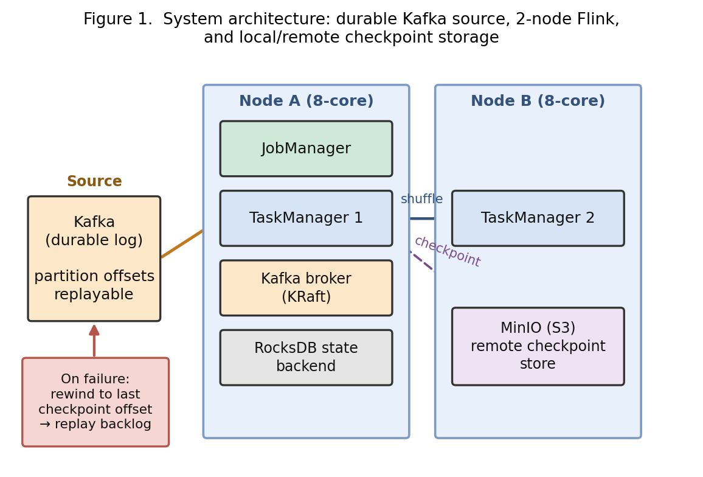
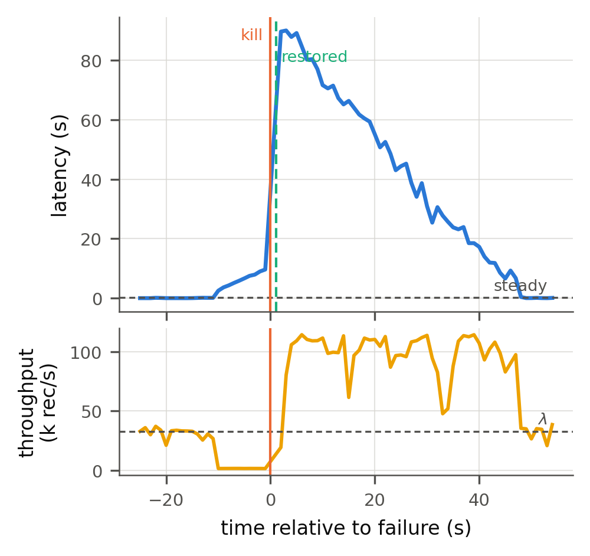
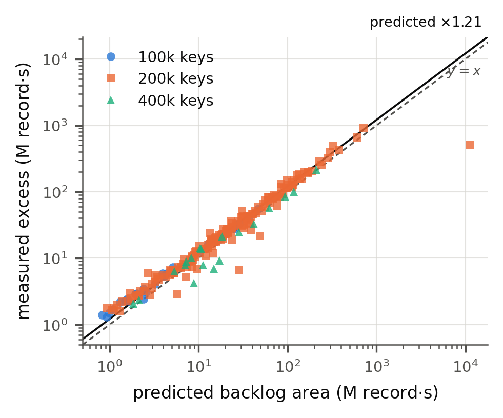
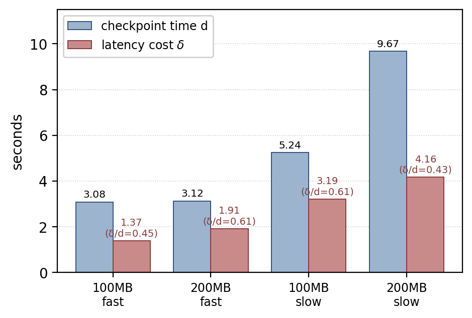
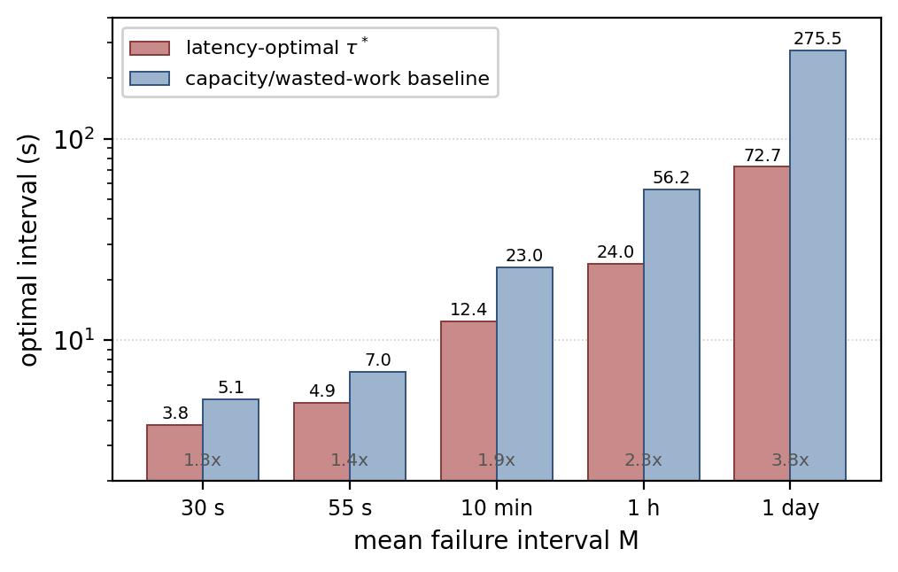

# 지연 민감형 분산 스트림 처리를 위한 체크포인트 주기 최적화
# Checkpoint Interval Optimization for Latency-Sensitive Distributed Stream Processing

> **문서 안내 (제출 전 삭제)**: 이 파일은 바탕화면의 ICNGC 참고논문
> (`ICNGC_+Heeseong_Shin 신희성.pdf`)의 **구성·표·그림 배치 방식**을 그대로 따른
> 6쪽 Regular Paper 예시입니다. 본문은 이해·검토용 한글이며, **실제 ICNGC 제출은
> 영문**이므로 본인이 영문화하면서 문장을 다시 쓰세요(AI 탐지 방지에도 유리).
> 모든 수치는 ρ버그 수정·2차 외부감사 반영 확정값입니다. 그림은 `figs/`에 있습니다.
> 표 = 로마숫자·캡션 위, 그림 = Figure N·캡션 아래 (참고논문 규칙).

---

**[저자 블록 — 본인이 채울 것]**

[제1저자]\*, [공저자]\*\*, [지도교수]\*\*
\* Dept. of ..., \*\* Dept. of Computer Science & Engineering, Graduate School,
Dankook University, Yong-in, Republic of Korea
[이메일들], ymnah@dankook.ac.kr

> ⚠️ 저자·소속·이메일은 실제 정보로 본인이 확정하세요. (임의 생성 금지)

---

## Abstract

*Abstract*― Apache Flink과 같은 상태 기반 분산 스트림 처리 시스템은 장애 복구를 위해
주기적으로 체크포인트를 생성한다. 주기가 짧으면 정상 처리 오버헤드가 커지고, 길면 장애
후 재처리량이 늘어 지연이 증가한다. 기존의 스트림 체크포인트 주기 연구는 주로 시스템
활용률(utilization)이나 처리 효율을 기준으로 최적 주기를 결정하였다. 그러나 지연 민감형
응용에서는 개별 레코드가 실제로 경험하는 지연을 직접 최소화하는 목적함수가 필요하다.
본 연구는 Kafka와 같은 durable source 환경에서 장애 후 발생하는 replay backlog에
주목한다. 복구 이후에도 실시간 입력이 계속 유입되므로 backlog는 전체 처리 용량이 아니라
잔여 용량(μ_d−λ)으로만 감소하며, 이로부터 장애 비용이 체크포인트 경과 시간의 제곱에
비례함을 유도한다. 정상 체크포인트 비용과 결합하여 지연 최소화 관점의 최적 주기를
도출한 결과, 지연 최적 주기는 용량 손실 기준의 √M 계열 기준식보다 느리게 증가하며(국소
지수 약 0.43~0.35) 장애가 드물수록 두 방식의 차이가 커진다. Apache Flink 1.20.5와
Kafka 3.9.2 환경의 단일 노드 255회 실험과 2노드 약 22회 실험에서, 각 장애의 입력률·복구 중
처리율·최대 지연만으로 자유 파라미터 없이 장애 지연 면적을 예측한 결과 대표 조건에서
R²=0.996을 얻었고 회귀 기울기도 예측값의 1.1배 수준이어서 관계의 형태뿐 아니라 크기도
재현되었다. 또한 지연 등가 체크포인트 비용은 단일 노드 로컬 저장소에서 체크포인트
소요의 0.43~0.61배였으나 2노드 원격 저장소에서는 0.18~0.23으로 감소하여, 체크포인트
비용이 배포 구조에 따라 달라짐을 보였다.

*Keywords*― Apache Flink, Apache Kafka, Checkpoint, Fault Recovery, Stream Processing,
Latency Optimization

---

## I. Introduction

실시간 로그 분석, 금융 거래 처리, IoT 모니터링 등에서는 지속적으로 도착하는 데이터를 낮은
지연으로 처리하는 것이 중요하다. Apache Flink과 같은 상태 기반 분산 스트림 처리 시스템은
연산자 상태와 입력 진행 위치를 체크포인트에 저장하여 장애 후 일관된 상태로 복구하며, 이는
exactly-once 보장에 필수적이다. 그러나 체크포인트는 저장장치와 CPU 자원을 소비하므로
적절한 생성 주기를 결정해야 한다.

체크포인트 주기 τ가 짧으면 장애 후 되돌아갈 구간은 줄지만 정상 처리 성능이 저하되고, τ가
길면 정상 오버헤드는 줄지만 복구할 데이터가 많아진다. 따라서 주기 선택은 정상 비용과 복구
비용 사이의 trade-off이다. Young과 Daly의 고전 연구[1][2]는 이 균형으로 최적 주기를
분석하였고, 이후 분산 스트림 환경을 위한 연구[3][4][5]도 수행되었다.

본 연구의 목적은 스트림 체크포인트 주기를 처음 다룬다거나 기존 연구가 지연을 고려하지
않았다고 주장하는 것이 아니다. 본 연구는 **주기를 결정하는 목적함수 자체**에 초점을 둔다.
기존에 주로 다룬 활용률·처리 효율과 달리, 지연 민감형 응용에서는 장애를 경험한 각 레코드가
얼마나 오래 지연되는지가 중요하다. 특히 Kafka와 같은 durable log를 입력으로 쓰면 장애 후
데이터가 사라지지 않고 마지막 체크포인트 이후 위치로 되감겨 다시 처리된다. 이때 새로운
실시간 입력도 계속 유입되므로 replay backlog는 전체 처리 능력이 아니라 잔여 용량으로만
감소한다.

본 논문의 기여는 다음과 같다.

1. durable replay 환경에서 backlog 감소 과정을 레코드 가중 지연 면적으로 모델링하고, 장애
   비용이 체크포인트 경과 시간의 **제곱**에 비례함을 유도한다.
2. 정상 체크포인트 비용과 replay 비용을 하나의 지연 목적함수로 결합해 최적 주기를 유도하고,
   용량 손실 기준의 √M 스케일링과 다른 스케일링을 보인다.
3. Flink/Kafka 실험에서 각 항을 독립 측정하고, 자유 파라미터 없이 장애 비용을 예측해 모델의
   기하 구조를 검증한다(R²=0.996).
4. 단일 노드와 2노드 분산·원격 저장소 환경에서 배포 구조가 비용에 미치는 영향을 분석한다.

## II. Related Work

### A. 고전 체크포인트 주기 모델

Young[1]은 재계산 비용과 체크포인트 비용의 균형으로 최적 주기를 근사하였고, Daly[2]는 이를
고차로 확장하였다. 이들도 장애 후 마지막 체크포인트로 rollback하여 재수행한다. 따라서
고전과 스트림의 차이를 "배치는 저장만 하고 스트림만 되감는다"로 구분하는 것은 정확하지
않다. 보다 본질적인 차이는 스트림이 종료되지 않는 unbounded 연산이며, **복구 중에도 새
데이터가 계속 유입**된다는 점이다.

### B. 스트림 처리용 체크포인트 최적화

Zhuang 등[3]은 전통적 OCI 모델이 복구 시간을 마지막 체크포인트 이후 실행시간으로만 보아
스트림에 부적합하며, 복구가 실시간 입력·재처리 workload에 의존함을 지적하였다. Jayasekara
등[4]은 분산 스트림의 활용률(utilization)을 최대화하는 주기를 모델링하고 Flink에서 검증
하였으며, 후속 연구[6]에서 latency·throughput 변화도 평가하였다. Zhang 등[5]은 Flink에서
workload intensity에 따른 tuple latency와 복구 시간을 추정해 최적 주기를 분석하였다.
Carbone 등[7]은 Flink 체크포인트의 기반인 비동기 배리어 스냅샷을 제안하였다.

본 연구는 이들을 기반으로 하되, continuous arrival이 존재할 때 replay backlog가 감소하는
기하를 명시적으로 유도하고, 그로부터 record-weighted latency를 직접 목적함수로 구성한다는
점에서 접근이 다르다. 즉 기존 연구가 utilization·processing efficiency를 최적화하거나
workload 의존적 tuple latency를 모델링한 것과 달리, 본 연구는 backlog drain geometry로부터
record-weighted latency cost를 직접 유도한다. Table I은 목적함수 관점의 차이를 요약한다.

**Table I. 관련 연구와 본 연구의 목적함수 비교**

| 연구 | 목적함수 | 검증 | 본 연구와의 차이 |
|---|---|---|---|
| Young[1]/Daly[2] | 낭비 작업/체크포인트 비용 | 이론 | 유한 연산, 복구 중 입력 유입 없음 |
| Zhuang[3] | 처리 효율 | — | 재처리의 입력 의존 지적 |
| Jayasekara[4,6] | 활용률(utilization) | Flink | 우리는 record latency |
| Zhang[5] | tuple latency 추정 | Flink | 우리는 backlog 기하 유도 |
| **본 연구** | **record latency 면적** | **무보정 R²=0.996** | quadratic 구조 유도·검증 |

## III. Latency-Based Checkpoint Model

### A. 시스템 모델 및 아키텍처

Figure 1은 실험 시스템의 구조를 보여준다. 입력은 durable log인 Kafka에서 공급되며, 장애 시
소비 offset을 마지막 체크포인트 위치로 되감아 데이터를 재생(replay)한다. Flink는 JobManager와
TaskManager로 구성되고 연산자 상태는 RocksDB 상태 백엔드에 저장된다. 체크포인트는 단일
노드에서는 로컬 파일시스템에, 2노드에서는 둘째 노드의 MinIO(S3 호환) 원격 저장소에 기록된다.



**Figure 1.** 시스템 아키텍처. durable Kafka source, 2노드 Flink 클러스터, 로컬/원격
체크포인트 저장소. 장애 시 마지막 체크포인트 offset으로 되감아 replay backlog가 발생한다.

기호는 다음과 같다. λ(입력률), μ(최대 처리율), ρ=λ/μ(가동률), τ(주기), a(장애 시 마지막
체크포인트 경과), D(실효 공백), μ_d(복구 중 처리율), M(평균 장애 간격), δ(지연 등가
체크포인트 비용). 장애 시 마지막 체크포인트 나이가 a, 처리 공백이 D이면 복구 직후 재처리
대상은 대략 `B₀ = λ(a+D)`이다. 복구 후에도 새 데이터가 λ로 유입되므로 backlog 감소 속도는
전체 처리율이 아니라 `μ_d − λ`이고, 제거 시간은 `T_c = λ(a+D)/(μ_d − λ)`이다.

### B. 장애에 의한 레코드 지연 비용

복구 직후 가장 오래된 레코드는 약 (a+D)의 지연을 겪고, backlog가 선형 감소하면 지연도
선형으로 줄어 지연-시간 영역은 **삼각형**이 된다(Figure 2). 이 기간 레코드는 μ_d로 처리
되므로 초과 지연의 합은

```
A = μ_d · ½(a+D) · T_c = μ_d·λ·(a+D)² / (2(μ_d − λ))
```

핵심은 장애 비용이 (a+D)에 선형이 아니라 **제곱**으로 증가한다는 점이다. 체크포인트가
오래될수록 재처리량이 늘 뿐 아니라 그 backlog를 제거하는 시간도 함께 길어지기 때문이다.



**Figure 2.** 단일 장애 에피소드의 지연·처리량 시계열. 장애 후 지연이 급증했다 삼각형으로
감소하며, 그 면적이 (a+D)의 제곱에 비례한다.

### C. 평균 지연 목적함수와 최적 주기

장애가 체크포인트 일정과 독립이면 a~U(0,τ)이므로 `E[(a+D)²] = τ²/3 + τD + D²`이다. 정상
상태 체크포인트에 의한 평균 지연 증가를 `δ²/(2(1−ρ)τ)`로 두면 전체 평균 지연은

```
L̄(τ) = ℓ₀ + δ²/(2(1−ρ)τ) + [μ_d/(2(μ_d−λ)M)]·(τ²/3 + τD + D²)
```

첫 가변 항은 τ 증가 시 감소, 둘째 항은 증가하므로 내부 최적점이 존재한다. 미분하여 0으로
두면 (`ρ_d = λ/μ_d`)

```
δ²·M·(1−ρ_d)/(1−ρ) = τ²·(2τ/3 + D)
```

D ≪ τ이면 `τ* ≈ (1.5·δ²M)^(1/3)`으로, 지연 최적 주기는 M에 대해 대략 세제곱근으로
증가한다(점근값). 비교를 위해 용량 손실(capacity/wasted-work)을 기준으로 한 baseline을
`τ*_cap ≈ √(2δ_cap·M/ρ)`로 두면 √M에 비례한다. 이 baseline은 본 모델의 용량 회계로
구성한 참조선이며 Jayasekara[4]의 정확한 활용률 최적값이 아니다. 따라서 동일 시스템이라도
용량 기준 주기와 지연 기준 주기는 서로 다른 값을 택할 수 있다.

### D. 평균 부하 안정 조건

장애 backlog를 다음 장애 전에 제거하지 못하면 지연이 누적된다. 평균 경과를 τ/2로 두면
예상 catch-up 시간으로부터 `λ(τ/2 + D)/(μ_d − λ) + D < M` 조건을 얻는다. 이는
deterministic hard bound가 아니라 first-moment 기반 평균 부하 안정 조건이며, 실제 장애
간격은 확률적이므로 개별 장애가 항상 이를 만족한다고 보장할 수는 없다.

## IV. Experiment

### A. 실험 환경

단일 노드 실험은 8코어 서버에서, 분산 실험은 동일 계열 두 서버로 수행하였다. Apache Flink
1.20.5를 standalone으로, Kafka 3.9.2를 KRaft 모드로 실행하고 RocksDB 상태 백엔드에 full,
exactly-once, aligned 체크포인트를 적용하였다. 2노드에서는 첫 노드에 JobManager·Kafka·
TaskManager를, 둘째 노드에 TaskManager와 MinIO를 배치하고 체크포인트를 S3 호환 원격
저장소에 기록하였다(Figure 1). Table II는 실험 환경을 정리한 것이다.

**Table II. 실험 환경**

| 항목 | 사양 |
|---|---|
| 노드 구성 | 8-core 서버 × 2 (단일 노드 / 2노드) |
| Stream engine | Apache Flink 1.20.5 (standalone) |
| Message broker | Apache Kafka 3.9.2 (KRaft) |
| State backend | RocksDB, full·exactly-once·aligned |
| 원격 체크포인트 저장소 | MinIO (S3 호환, 2노드) |
| 상태 크기 | 약 100 / 200 / 400 MB |
| 기준 가동률 ρ | 0.5 (일부 0.3, 0.65, 0.8) |
| 실험 규모 | 단일 노드 255 run + 2노드 약 22 run, 체크포인트 13,000+ |
| 분석 사용 비율 | 약 34% (나머지는 IV.B의 제외 기준·저장소 열화) |
| 연속 가동 | 약 48시간 |

### B. 워크로드·계측·장애 주입

상태 크기와 처리율을 독립 조절하기 위해 합성 workload를 사용하였다. 레코드당 CPU 부하는
spin loop로, 상태 크기는 key 개수로 조절하였다(RocksDB 압축을 피하기 위해 키 기반 의사난수
데이터 사용). 지연은 Flink의 장기 평균 metric 대신 애플리케이션 내부에서 레코드 생성 시각과
처리 시각의 차로 직접 측정하고, 500ms마다 처리 레코드 수를 가중치로 한 record-weighted
mean을 기록하였다.

장애는 TaskManager 강제 종료 후 재기동으로 주입하였다. 장애 간격은 단순 Poisson이 아니라
지수분포 간격에 최소 40초 하한을 적용한 exponential-gap renewal process로 생성하였다. 명목
MTBF는 55초였으나 실제 주입된 평균 간격은 약 **72.8초**였으며, M이 필요한 분석에서는 실측
간격을 사용한다. 분석에서는 (i) 주기가 체크포인트 소요의 2배보다 짧은 run, (ii) 처리량이
입력을 못 따라가는 run, (iii) 정상 회복하지 못한 run, (iv) 측정 창 내 복구가 끝나지 않은
censored episode를 구분하였다. τ<2d 기준은 물리적 최소 주기가 아니라 1/τ 정상상태 회귀를
안정적으로 측정하기 위한 경험적 분석 임계값이다. 이 기준들과 뒤에 서술할 저장소 열화를
함께 적용하면 **분석에 사용한 run은 전체의 약 34%**이다. 제외된 run도 폐기하지 않고
보관하였으며, 특히 (iii)에 해당하는 run은 IV.C-4의 안정성 논의에 사용한다.

### C. 실험 결과

**1) 장애 지연 비용의 무보정 검증.** 각 장애에서 입력률 λ, 복구 중 처리율 μ_d, 최대 지연
p를 직접 측정해 `A_pred = μ_d·λ·p²/(2(μ_d−λ))`를 계산하였다. 즉 모델에 맞추기 위한 자유
파라미터를 추가하지 않고 관측값만 사용하였다. 100k key·ρ=0.50 조건 30개 에피소드에서
예측과 측정의 결정계수는 **R²=0.996**, 200k key·ρ≈0.30 조건 61개 에피소드에서 **R²=0.982**
였다. 결정계수는 예측식이 관계의 *형태*를 재현하는지만 말해주므로, 크기까지 맞는지는
회귀 기울기로 확인하였다. 두 조건의 기울기는 예측값의 각각 **1.11배·1.09배**였다.

Figure 3은 세 상태 크기(100k·200k·400k key)의 사용 가능한 에피소드를 모두 모은 것으로,
위 두 조건보다 넓은 모집단이다. 이 전체 집합에서 실측은 예측의 **약 1.2배**에 정렬되며,
그 관계는 네 자릿수(10⁰~10⁴ M record·s) 범위에 걸쳐 유지된다. 즉 예측식은 비용의
기하 구조를 재현하되 **크기를 10~20% 과소평가하는 계통 편차**를 가지며, 실용적으로는
보수적인(비용을 낮게 보는) 추정이다.

본 검증은 별도의 자유 파라미터를 데이터에 적합하지 않으므로, 회귀 파라미터
적합에 따른 과적합 가능성을 줄이고 예측식의 기하학적 관계 자체를 평가할 수 있다. 다만
episode 제외 기준, μ_d 측정 방식, 최대 지연의 정의와 같은 분석 선택은 여전히 존재한다.



**Figure 3.** 자유 파라미터 없는 장애 지연 비용 예측. 측정한 λ, μ_d, 최대 지연만으로 계산한
예측(x)과 실측 초과 지연 면적(y). 세 상태 크기의 에피소드를 모두 포함하며, 실선은 실측
대 예측의 중앙 비(×1.21), 점선은 y=x이다. 네 자릿수 범위에 걸쳐 동일한 비례 관계가
유지된다.

**2) 체크포인트의 두 가지 비용과 δ.** 체크포인트 중 손실 처리 용량으로 계산한 비용은 약
0.15~0.22초였으나, 정상 지연 곡선에서 추정한 지연 등가 비용 δ는 약 1.37~4.16초로 조건에
따라 8.8~18.6배 차이였다. 이는 체크포인트가 모든 연산을 정지시키지 않아도 barrier·상태
스냅샷·순간 지연으로 많은 레코드의 지연을 늘리기 때문이다. Figure 4는 네 조건에서 체크포인트
소요 d와 지연 비용 δ를 비교한 것으로, δ/d는 0.43~0.61 범위에 위치한다. 따라서 로컬 저장소
에서는 δ≈d/2를 초기 추정으로 쓸 여지가 있으나, 이는 일반 법칙이 아니다. 2노드 원격 저장소
에서는 δ/d가 0.18~0.23으로 감소한다(Table IV). 다만 Table III 아래에 적었듯 네 조건은
저장소 속도와 가동률이 동시에 변하므로, 이 범위는 두 요인의 결합 효과로 읽어야 한다.



**Figure 4.** 조건별 체크포인트 소요 d와 지연 등가 비용 δ. δ/d는 로컬 저장소 네 조건에서
0.43~0.61에 위치한다(ρ버그 수정 반영값).

**Table III. 조건별 체크포인트 비용 δ** (적합 R²는 δ 추정에 쓴 1/τ 정상상태 회귀의 값)

| 상태 | 저장소 | ρ | δ (s) | d (s) | δ/d | 적합 R² |
|---|---|---|---|---|---|---|
| 100 MB | 빠름 | 0.50 | 1.371 | 3.08 | 0.45 | 0.979 |
| 200 MB | 빠름 | 0.50 | 1.907 | 3.12 | 0.61 | 0.863 |
| 100 MB | 느림 | 0.30 | 3.195 | 5.24 | 0.61 | 0.967 |
| 200 MB | 느림 | 0.30 | 4.159 | 9.67 | 0.43 | 0.791 |

이 네 조건은 저장소 속도와 가동률이 함께 변한다(빠름=ρ0.50, 느림=ρ0.30). 따라서 δ/d
범위를 저장소 효과나 부하 효과 어느 한쪽으로 귀속할 수 없으며, 범위의 양 끝을 만드는
200 MB 두 조건은 회귀 적합도도 상대적으로 낮다(R²=0.863, 0.791). 본 표는 δ가 d와 같지
않고 조건에 따라 그 비가 크게 달라진다는 점을 보이는 용도로만 해석한다.

**3) 목적함수에 따른 최적 주기.** 유도한 모델(기준 arm δ=1.907s, D=4.28s, ρ=0.5)로 지연
최적 주기와 용량/낭비 기준(capacity/wasted-work baseline) 주기를 비교하였다(Figure 5).
장애 간격 M이 커질수록 두 방식의 차이가 증가한다. 용량/낭비 기준은 대략 `τ* ∝ √M`이나, 지연
모델은 국소 지수가 M=55s에서 약 0.43, M=1일에서 약 0.35로 나타나 √M보다 느리게 증가한다
(1/3 점근). 따라서 장애가 드문 환경일수록 용량/낭비 기준으로 택한 긴 주기가 지연 민감형
응용에는 과도하게 길 수 있다.



**Figure 5.** 목적함수별 최적 주기의 M 의존성. 용량/낭비 기준(√M)은 M=1일에서 지연 최적
주기의 약 3.8배까지 벌어진다. 바 위 배율은 두 기준의 비이다.

**4) 저장소 성능 변화와 안정성.** 31시간 연속 실험 중 체크포인트 쓰기 처리량이 약 288 MB/s
에서 63 MB/s로 감소해 동일 상태에서도 체크포인트 소요가 2~3초에서 8~10초로 늘었다
(`iostat` %util 90.6%, SLC 캐시 소진 추정). 이 열화가 주기 실행 순서와 상관되면 회귀를
오염시키므로, 주기 순서를 무작위화하고 고정 주기 control run을 배치하였다. 또한 일부 조건
에서 τ가 길수록 장애 backlog를 다음 장애 전에 제거하지 못해 지연이 누적되었다(대표 실험에서
τ=64초까지 정상 회복, τ=128초에서 회복 실패). 이는 주기 최적화가 안정 영역 내에서 수행되어야
함을 의미한다.

**5) 2노드 분산 환경.** 단일 노드는 로컬 파일시스템을, 2노드는 둘째 서버의 MinIO 원격
저장소를 사용하였다. 2노드 실험은 약 22 run(기준·상태 크기·복원 시간 재측정)으로 단일
노드보다 규모가 작다. 이 조건에서 Flink가 보고한 엔진 복원 시간은 약 1.20초에서 2.39초로
증가하였다(Table IV, 12개 장애 에피소드의 중앙값).

반면 δ/d는 감소하였다. 그러나 이 감소를 δ 자체의 개선으로 읽어서는 안 된다. 비교 대상인
단일 노드 값은 저장소 열화가 진행된 실험 후반의 것으로 체크포인트 소요 d가 8~9초까지
늘어난 상태이고, 2노드에서는 d가 2.5~6초였다. 즉 δ/d가 낮아진 데에는 **분모 d가 서로 다른
저장소 상태에서 측정되었다는 사정**이 함께 들어 있다. 여기에 더해 단일 노드와 2노드 비교
에서는 노드 topology와 체크포인트 저장소 backend가 동시에
변경되었으므로 복원 시간 증가를 network distance만의 인과로 해석할 수 없다. 또한 두 노드 간
약 0.1초의 clock offset이 관찰되어 수백 ms 규모의 δ 비교에는 오차가 존재한다. 따라서 본
결과는 "분산 배치와 원격 저장소를 함께 사용한 구성에서 복구 시간이 증가하였다"로 제한적으로
해석한다.

**Table IV. 단일 노드 대 2노드 분산**

| 지표 | 1노드 | 2노드 | 비고 |
|---|---|---|---|
| 엔진 복원 시간 | 1.20 s | 2.39 s | ×2.0 |
| 체크포인트 소요 d | 8~9 s (열화 후반) | 2.5~6 s | 저장소 상태가 다름 |
| δ/d | 0.43~0.61 | 0.18~0.23 | 위 d 차이가 함께 반영됨 |
| 실험 규모 | 255 run | 약 22 run | — |
| 클럭 오차 | — | ~0.1 s | (한계) |

## V. Conclusion

본 연구는 durable source를 사용하는 분산 스트림 처리에서 체크포인트 주기를 record-weighted
latency 관점으로 분석하였다. 장애 후 replay 시 새 입력이 계속 유입되므로 backlog는 잔여
용량 μ_d−λ로만 감소하며, 이로부터 장애 비용이 (a+D)²에 비례함을 유도하였다. 이를 정상
체크포인트 비용과 결합하면 용량 손실 기준(√M)과 다른 최적 주기가 도출되며, 일정 조건에서
지연 최적 주기는 √M보다 느리게(국소 0.43~0.35) 증가한다. Flink/Kafka 실험에서 개별 장애
측정값만으로 계산한 지연 비용이 실측을 대표 조건에서 R²=0.996으로 설명하였고, 체크포인트의
지연 등가 비용이 단순 용량 손실보다 크며 배포·저장소 구조에 따라 상반되게 변할 수 있음을
확인하였다. 향후 로컬/원격 저장소를 독립 변경하는 실험, 더 많은 노드, 실제 workload, 다양한
장애 유형으로 일반성을 검증할 계획이다. 본 연구의 원자료(255회 실험, 13,000회 이상 체크
포인트)와 분석 스크립트를 공개하며, 논문의 수치는 검증 스크립트로 재확인할 수 있다.

## Acknowledgment

[사사 문구 — 해당 시 지도교수/연구실이 제공하는 과제 지원 문구를 본인이 기입]

## References

[1] J. W. Young, "A first order approximation to the optimum checkpoint interval,"
*Communications of the ACM*, vol. 17, no. 9, pp. 530–531, 1974.
[2] J. T. Daly, "A higher order estimate of the optimum checkpoint interval for restart
dumps," *Future Generation Computer Systems*, vol. 22, no. 3, pp. 303–312, 2006.
[3] Y. Zhuang et al., "An optimal checkpointing model with online OCI adjustment for
stream processing applications," in *Proc. ICCCN*, 2018.
[4] S. Jayasekara et al., "A utilization model for optimization of checkpoint intervals
in distributed stream processing systems," *Future Generation Computer Systems*, 2020.
[5] Z. Zhang et al., "Research on optimal checkpointing-interval for Flink stream
processing applications," *Mobile Networks and Applications*, 2021.
[6] S. Jayasekara et al., "Optimizing checkpoint-based fault-tolerance in distributed
stream processing systems: theory to practice," *Software: Practice and Experience*, 2022.
[7] P. Carbone et al., "Lightweight asynchronous snapshots for distributed dataflows,"
arXiv:1506.08603, 2015.

> ⚠️ **참고문헌 확정 규칙**: 위 서지정보(권·호·쪽·연도)는 반드시 DOI로 직접 확인 후
> BibTeX으로 확정하세요. GPT/AI가 제시한 서지정보는 틀릴 수 있습니다. Zhang[5] 원문은
> 반드시 직접 읽고 차별점을 최종 확인하세요.

---

## 부록 — 편집·검토 메모 (제출 전 삭제)

- **구성 근거**: 바탕화면 `ICNGC_+Heeseong_Shin 신희성.pdf`의 배치를 따름.
  Table = 로마숫자·캡션 위 / Figure = 캡션 아래 / Related Work에 A·B 소절 / 마지막에
  Acknowledgment·References. 실제 ICNGC 템플릿은 **2단 조판**이라 이 순서 그대로 넣으면 됨.
- **그림 5장** (전부 `figs/`에 PNG·PDF 있음):
  - Figure 1 `fig_arch` — 아키텍처(신규 생성). 참고논문 Figure 1(Sqoop overview)에 해당.
  - Figure 2 `fig0_trace` — backlog 삼각형(메커니즘).
  - Figure 3 `fig3_area_validation` — 무보정 R²=0.996 ★ 핵심.
  - Figure 4 `fig_bar_delta` — δ vs d 막대그래프(신규 생성). 참고논문 Figure 3~5(막대)에 해당.
  - Figure 5 `fig_bar_tau` — 최적주기 스케일링 막대그래프(신규 생성, 로그축).
- **표 4개**: Table I 관련연구, Table II 실험환경, Table III δ, Table IV 1v2노드.
- **6쪽 압축**: 2단에 넣어 넘치면 IV.C-4(저장소/안정성)를 2~3문장으로 줄이고, Table III·IV 중
  하나를 본문 수치로 흡수. 주인공은 **latency checkpoint model**이므로 Figure 3·4·5와
  Table I·III를 최우선으로 살릴 것.
- **용어 규칙**: √M 비교선은 **용량/낭비 기준(capacity/wasted-work baseline)**으로만 부를 것.
  "활용률(utilization) 최적"은 Jayasekara[4]의 것을 가리킬 때만 사용(혼용 금지).
- **확정 수치**: δ 100MB 1.371 / 200MB 1.907(빠름), 3.195 / 4.159(느림);
  δ 적합 R² 0.979/0.863/0.967/0.791; 무보정 예측 R² 0.996(30 ep)·0.982(61 ep),
  기울기/예측 1.107·1.092, 전체 중앙배율 1.21; δ/d 0.43~0.61(1노드)·0.18~0.23(2노드);
  2노드 복원 2.39s(12 ep 중앙값), 2노드 약 22 run; 분석 사용 비율 약 34%;
  M_eff 72.8s; 배율 1.3/1.4/1.9/2.3/3.8.
- **2차 감사에서 고친 것(2026-09-11)**: ①Figure 3 캡션이 실제 그림(×1.21 선, 4자릿수
  범위)과 어긋나 있던 것 수정 + 기울기 수치 본문 추가 ②Table III에 적합 R² 열과
  저장소·ρ 교락 주석 추가 ③1노드 대 2노드 δ/d 비교에 저장소 열화가 섞여 있음을 명시
  (분모 d가 8~9s 대 2.5~6s) ④2노드 run 수·분석 사용 비율(34%)·연속 가동 시간 공개.
- **본인이 직접**: ①저자·소속·이메일 확정 ②참고문헌 DOI 확인 ③영문화하며 문장 재작성
  (AI 탐지 방지) ④지도교수 AI정책 상의.
